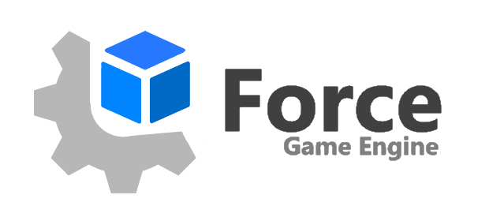

# Force

**Force** this is an game engine for writing any 2D and 3D (in future) graphic applications including games. It is written in C++.
And now engine support [OpenGL](https://www.khronos.org/opengl/), [DirectX](https://en.wikipedia.org/wiki/DirectX) and maybe in future
[Vulkan](https://www.khronos.org/vulkan/) graphical API's.  Its only for Windows for now, other platforms such a Mac and Linux will be also
support in a far future.

| :hammer_and_wrench:**Build**     |            | :earth_americas:**Official Home**                           |
|----------------------------------|------------| ---------------------------------------------------------- |
| :green_circle:Pre-release        | [0.3.10](https://github.com/KennyProgrammer/Force/releases) | [Explore](https://danil-dukhovenko.gitbook.io/force/) |
| :red_circle:Development          | 0.4.0-Q2  |

## Content
* [Introduction](#introduction)
  * [Install](#install)
  * [Documentation](#documentation)
* [Additional Information](#additional-information)
  * [Open Source Technologies used in Force](#open-source-technologies-used-in-force)
  * [License](#license)
  * [Contributors](#contributors)

## Introduction
### Install

To quickly install and configure this engine on Windows go to [**Releases**](https://github.com/KennyProgrammer/Force/releases) page and download 
latest release. Force Editor now currenly in beta state, but already stable and support a bunch of features. If some binary is missing that popup the error message let me know.

### Documentation
You can read new documentation how install and work with engine, how write scripts and make games [here](https://danil-dukhovenko.gitbook.io/force/).

## Additional Information

If you interesed on you can check Force [Roadmap](.github/Force-RoadMap.md) to see completed and not completed features.

### Contributors

If you find you can help me and want to contribute to the project with your experience or you do want to get part of the project for some other
reasons, feel free to contact me directly, sending a email here on kennytuts@gmail.com and get a chance to get access to Force Private Development Repository.

### License

Code and documentation Copyright (c) 2020-2023 Dukhovenko Danila.\
Logo Copyright (c) 2023 Dukhovenko Danila.

Engine and external sets of in-engine tools `'not open source code'` will be released under [the MIT license](./).\
Documentation released under [CC BY 4.0](https://creativecommons.org/licenses/by/4.0/).\
Logo released under [CC BY-SA 4.0](https://creativecommons.org/licenses/by-sa/4.0/).

### Open Source Technologies Used In Force

* C++ 17 Standard
* Premake
* OpenGL
* DirectX
* DXTK
* Stb Image
* Glm
* Glfw
* Dear ImGui
* Imguizmo
* Spdlog
* Glad
* ENTT
* Assimp
* Yaml
* Mono
* Box2D
* OpenAL Soft
