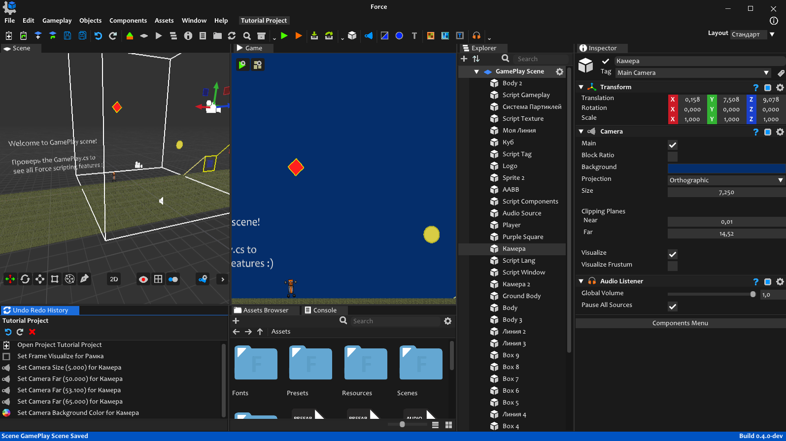

# Force

## Overview

[**Force**](https://danil-dukhovenko.gitbook.io/force) is a game engine for making **any 2D and 3D (in future) graphics applications, games**. It is written in C/C++ with C# as scripting language. Force support [OpenGL](https://www.khronos.org/opengl/), [DirectX](https://en.wikipedia.org/wiki/DirectX) and maybe in future
[Vulkan](https://www.khronos.org/vulkan/) rendering API's. Its supports Windows for now as main platform, other desktop platforms (Mac, Linux) and mobile platforms (IOS, Android) will be also support in a far future. 

| 🛠️ **Build** | 📑 **Type** | |
|------|------|------|
| 🟢[0.4.0](https://github.com/KennyProgrammer/Force/releases/tag/v0.4.0)| Pre-release | 100% |
🔴[2025.b1](https://github.com/KennyProgrammer/Force/issues/12)| Stable-release|   0% |

Looking for other builds? Go to releases [page](https://github.com/KennyProgrammer/Force/releases). 

**Development of 2025.b1 starts after April 24.**

## Introduction

**Force** was developing by one person [Danil Dukhovenko](https://github.com/KennyProgrammer/Force/commits?author=KennyProgrammer) from [January 2020](https://danil-dukhovenko.gitbook.io/force/other/insider) and still by present day. Force still on very early stage, because working on it by myself. So it needs get a lot more features for now to left this early stage. In future where engine steps some **stability point**, i will attach other developers, and create open source-community driven technology. 

If you interesed you can check Force global [Roadmap](.github/Force-RoadMap.md) to see completed and not yet completed features.

 

### Install

To use Force, you can download official Editor binaries on [**Releases**](https://github.com/KennyProgrammer/Force/releases) page, or through [**Force Nave**](https://github.com/KennyProgrammer/Force-Nave). 

**If some binary is missing that popup the error message let me know.**

### Documentation
The [official documentation](https://danil-dukhovenko.gitbook.io/force/) about how install and work with **Force**, how write scripts and make games its now on **Force official home**.

The [script reference](https://danil-dukhovenko.gitbook.io/force/force-scripting-api) of every class that you can use in scripting is also available and growing every release. 

## Additional Information

### Contributors

If you find you can help me and want to contribute to the project with your experience or you do want to get part of the project for some other
reasons, feel free to contact me directly, sending a email here on kennytuts@gmail.com and get a chance to get access to Force Private Development Repository.

### License

Code and documentation Copyright (c) 2020-2025 Dukhovenko Danila.\
Logo Copyright (c) 2025 Dukhovenko Danila.

Engine and external sets of in-engine tools `'not open source code'` will be released under [the MIT license](./).\
Documentation released under [CC BY 4.0](https://creativecommons.org/licenses/by/4.0/).\
Logo released under [CC BY-SA 4.0](https://creativecommons.org/licenses/by-sa/4.0/).

### Open Source Technologies Used In Force

 **Languages**

* C++
* C#
* Lua
* Python

 **Build Managers**

* Premake
* VcPKG

 **Software**

* OpenGL
* D3D10
* D3D11
* D3D12
* Vulkan
* DXTK
* DXErr
* Stb
* Glm
* Glfw
* ImGui
* ImGuizmo
* Spdlog
* Glad
* ENTT
* Assimp
* Yaml
* Mono
* Box2D
* OpenAL-Soft
* LibSndFile
* LibMp3Lame
* Mpg123
* Ogg
* Flac
* Opus
* Vorbis
* VorbisEnc
* LibCurl
* ZLib
* LibZip
* MiniZip
* PugiXml
* UtfCpp
